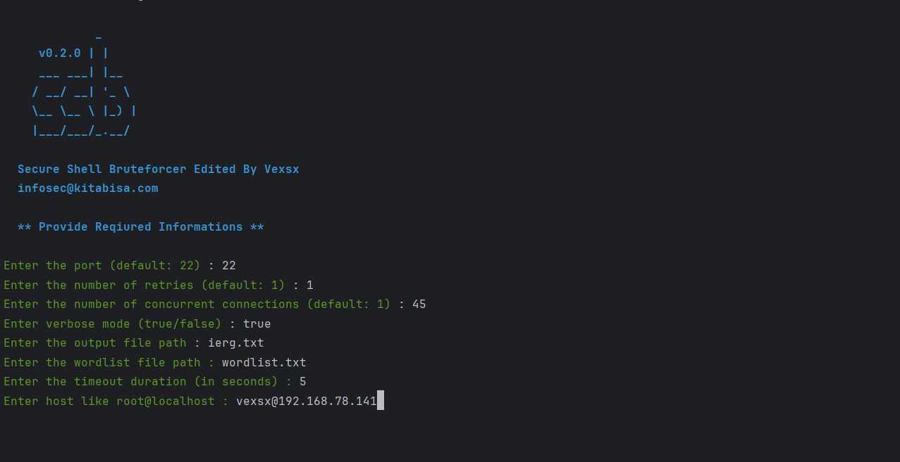

# ⚠️ SSH  V BRUTER (old ssb)

##


[](http://golang.org)


**V**_exsx_ **S**_ecure_ **S**_hell_ **B**_ruteforcer_ — A faster & simpler way to bruteforce SSH server.  
this is a none flag usage application  
main source code is (ssb) from `Pwnesia`


## ♨️ Features

* Fast
#
## 🤖 Run 
must installed go then in location terminal 
```bash
GO Run ./main.go
```

#

## 🖼️ image 



================================================================

